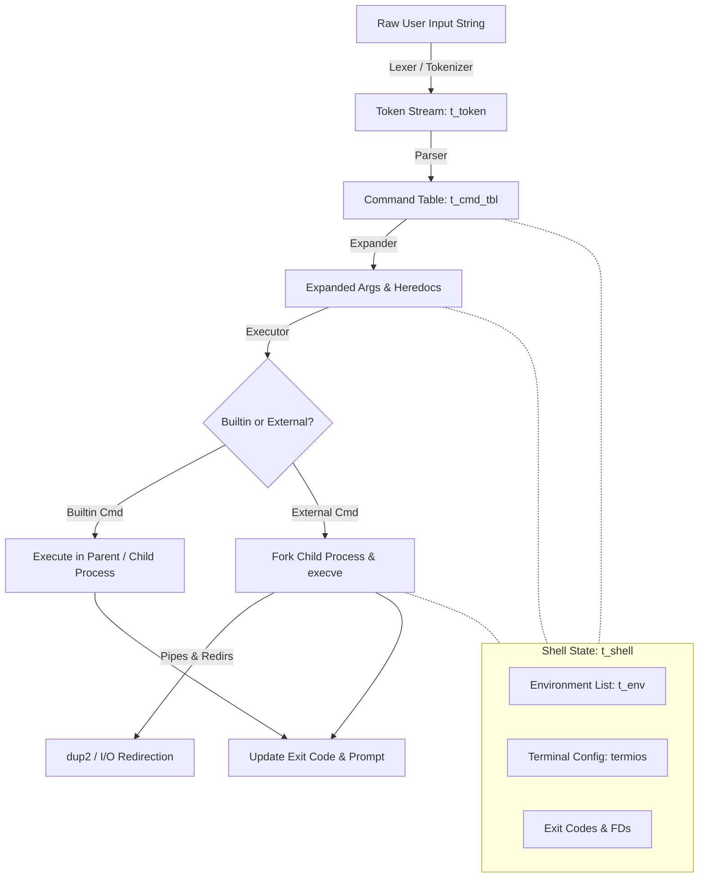

# MiniShell Interview Showcase Guide

> [!IMPORTANT]
> **Core Strategy for General SE / Backend Roles**: Frame **MiniShell** not just as a "C school project," but as a **complete language interpretation and process orchestration pipeline**. Backend engineering relies heavily on parsing protocols, managing system resources, handling asynchronous signals, and designing clean, modular architectures—all of which are demonstrated in this project.

---

## 1. The Elevator Pitch (30–45 Seconds)

When the interviewer asks: *"Tell me about a project you're proud of,"* or *"Walk me through MiniShell,"* use this structured pitch:

> *"I built **MiniShell**, a custom UNIX shell implementation written from scratch in C. At its core, a shell is an interactive systems programming pipeline: it takes raw user input, tokenizes and parses it into an abstract command structure, expands environment variables, and orchestrates process execution using system calls like `fork`, `execve`, and `pipe`.*
> 
> *What makes this project relevant to backend engineering is its focus on **clean architecture, resource management, and robustness**. I designed it with strict separation of concerns between the lexer, parser, expander, and executor. Because C has no garbage collection, I implemented rigorous memory management to guarantee **zero memory leaks or file descriptor leaks**, even under complex error conditions or signal interruptions."*

---

## 2. Architecture & Pipeline Flow

Use this mental model (or sketch it out on a whiteboard/screen share) to explain how data flows through your shell.



### Key Data Structures
Showcase your clean struct definitions in [structs.h](file:///Users/harleyng/42KL/7-Minishell/includes/structs.h#L28-L77):
- **`t_token` (Doubly Linked List)**: Represents lexed words, operators (`|`), and redirections (`<`, `>`, `>>`, `<<`). Doubly linked lists allow seamless lookahead and backtracking during syntax validation.
- **`t_cmd_tbl` (Command Table)**: Groups tokens into discrete commands separated by pipes. Each node holds the command name, argument array (`char **cmd_args`), and redirection lists.
- **`t_env` (Environment List)**: A dynamic linked list representing environment variables, allowing O(1) insertions and clean updates for builtins like `export` and `unset`.

---

## 3. Top Technical Talking Points

When diving into technical details, focus on these four pillars that resonate strongly with General SE and Backend interviewers:

| Pillar | What to Highlight | Where in Codebase |
| :--- | :--- | :--- |
| **1. Modular Architecture** | Clean separation between [parsing](file:///Users/harleyng/42KL/7-Minishell/parsing) (lexer, syntax checks, AST building) and [execution](file:///Users/harleyng/42KL/7-Minishell/execution) (process spawning, builtins). | [minishell.h](file:///Users/harleyng/42KL/7-Minishell/includes/minishell.h), [parsing/](file:///Users/harleyng/42KL/7-Minishell/parsing), [execution/](file:///Users/harleyng/42KL/7-Minishell/execution) |
| **2. Process & IPC Orchestration** | Managing multi-stage pipelines (`cmd1 \| cmd2 \| cmd3`) using `pipe()`, `fork()`, and `dup2()`. Handling parent/child synchronization via `waitpid()` without causing zombie processes or deadlocks. | [execution/executor](file:///Users/harleyng/42KL/7-Minishell/execution/executor) |
| **3. Asynchronous Signal Handling** | Handling `SIGINT` (Ctrl+C) and `SIGQUIT` (Ctrl+\\) gracefully. Distinguishing between interactive prompt mode, heredoc input mode, and child process execution mode using `sigaction` and terminal attributes (`struct termios`). | [minishell_source/signals](file:///Users/harleyng/42KL/7-Minishell/minishell_source/signals) |
| **4. Strict Resource Management** | Guaranteeing zero memory leaks and closing all unused file descriptors across parent and child processes. Building centralized cleanup utilities for teardown. | [minishell_source/cleanup_tools](file:///Users/harleyng/42KL/7-Minishell/minishell_source/cleanup_tools) |

> [!TIP]
> **The "File Descriptor Hygiene" Point**: Interviewers love hearing about resource leaks. Explain how in a pipeline, failing to close read/write ends of a pipe in unused processes causes EOF to never be sent, leading to hung processes (deadlocks). Mentioning how you strictly managed FDs shows mature systems understanding!

---

## 4. Live Demo Script (5-Minute Flow)

If you have the opportunity to share your screen and run a live demo, follow this exact sequence to showcase all major features smoothly without getting bogged down:

### Step 1: The Basics & Environment Expansion
Demonstrate parsing and environment variable lookup.
```bash
# Show clean prompt and basic command execution
ls -la

# Show environment variable expansion and quotes handling
echo "Hello $USER, welcome to MiniShell! Exit code was: $?"
```

### Step 2: I/O Redirection & Heredocs
Demonstrate file descriptor manipulation and input streams.
```bash
# Output redirection
echo "Backend engineering requires robust I/O handling" > demo.txt
cat demo.txt

# Append redirection
echo "Adding a second line to our file" >> demo.txt
cat demo.txt

# Heredoc (<<) demonstration
cat << EOF
This is a multi-line heredoc stream.
It supports variable expansion like: $USER
EOF
```

### Step 3: Multi-Stage Pipelines (IPC)
Demonstrate process forking and inter-process communication.
```bash
# Pipeline combining external commands, grep filtering, and word counting
cat demo.txt | grep "Backend" | wc -w
```

### Step 4: Builtin Commands & State Mutation
Demonstrate commands that must execute in the parent shell process.
```bash
# Why cd and export must be builtins (modifying parent process state)
export INTERVIEW_STATUS="SUCCESS"
echo "Interview Status: $INTERVIEW_STATUS"

# Clean cleanup and exit
rm -f demo.txt
exit
```

---

## 5. Common Interview Questions & Winning Answers

### Q1: Why did you use linked lists for tokens and commands instead of arrays?
> **Answer:** *"In a shell, user input is dynamic and unpredictable in length. During lexing and parsing, we frequently need to insert, remove, or regroup tokens (for example, handling quoted strings or variable expansions). A doubly linked list gives us O(1) insertions and removals and allows easy bidirectional traversal for syntax validation (e.g., checking what comes immediately before or after a pipe symbol). Once the AST/command table is finalized, we convert the arguments into null-terminated `char **` arrays specifically for `execve()` compatibility."*

### Q2: How do you handle race conditions or deadlocks in pipelines?
> **Answer:** *"Deadlocks in pipes usually happen when a process is waiting for an EOF (end-of-file) that never arrives because another process still has the write-end of the pipe open. In my executor, I implemented strict **file descriptor hygiene**: immediately after forking or duplicating FDs with `dup2()`, every unused pipe endpoint is explicitly closed in both parent and child processes. Furthermore, the parent shell waits for child processes using `waitpid()` in the correct order to capture exit statuses without race conditions."*

### Q3: How did you handle memory leaks in C without a garbage collector?
> **Answer:** *"I established a clear ownership model for dynamically allocated memory. Every major subsystem—parsing, environment storage, and execution—has dedicated cleanup routines in [cleanup_tools](file:///Users/harleyng/42KL/7-Minishell/minishell_source/cleanup_tools). When a command finishes or if a syntax error occurs mid-parse, the shell traverses and frees the command tables, token lists, and temporary AST structures while preserving the core environment list. I continuously tested the shell using `valgrind` and AddressSanitizer to verify zero leaks across edge cases."*

### Q4: If you were to scale this into a production shell or scripting language, what would you add or change?
> **Answer:** *"I would introduce three key architectural upgrades:
> 1. **Abstract Syntax Tree (AST)**: Transitioning from a sequential command table to a true AST binary tree to support logical operators (`&&`, `||`), subshells (`()`), and control flow (`if/else`, `while` loops).
> 2. **Job Control**: Adding process group management (`setpgid`, `tcsetpgrp`) to support background jobs (`&`), `ctrl+z` suspension, and `fg`/`bg` commands.
> 3. **Hash Table for PATH Lookup**: Instead of scanning directories in `$PATH` sequentially for every external command, caching binary locations in a hash table for O(1) command resolution."*

---

## 6. Pre-Interview Checklist

- [ ] **Compile & Test**: Run `make` in `/Users/harleyng/42KL/7-Minishell` and ensure zero warnings or build errors.
- [ ] **Terminal Setup**: Increase your terminal font size slightly so it's easily readable over screen share.
- [ ] **Open Key Files in IDE**: Have [minishell.h](file:///Users/harleyng/42KL/7-Minishell/includes/minishell.h), [structs.h](file:///Users/harleyng/42KL/7-Minishell/includes/structs.h), and [execution/executor](file:///Users/harleyng/42KL/7-Minishell/execution/executor) open in tabs so you can switch to them instantly if asked to show code!
